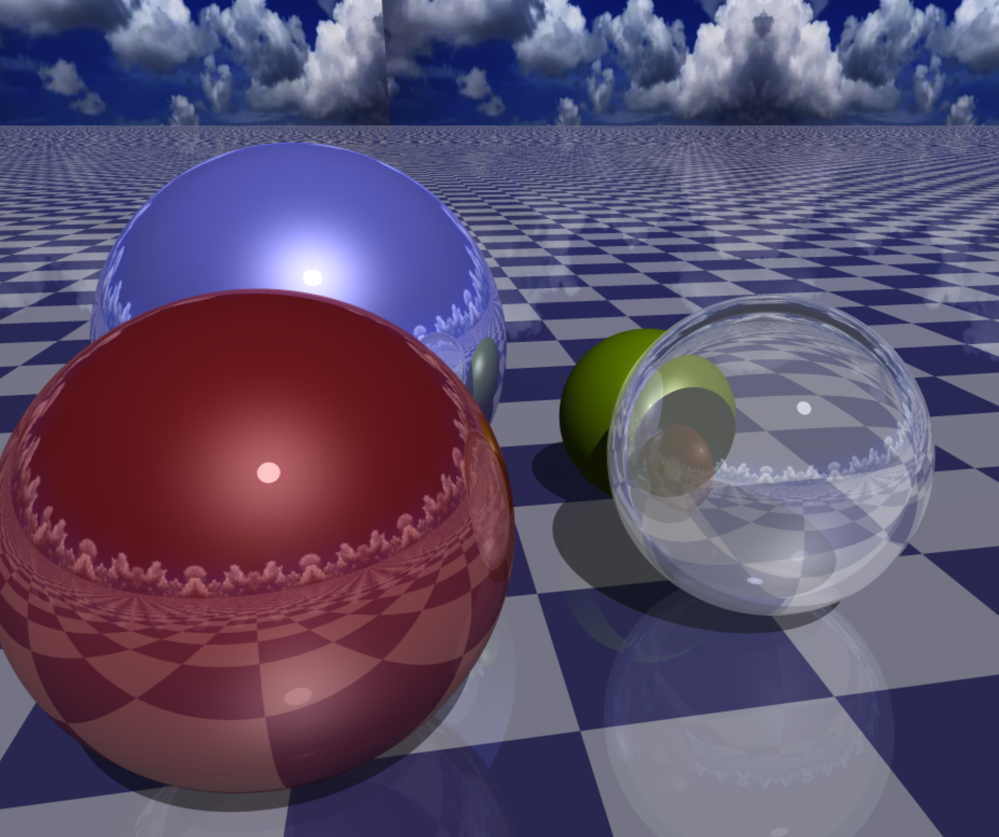
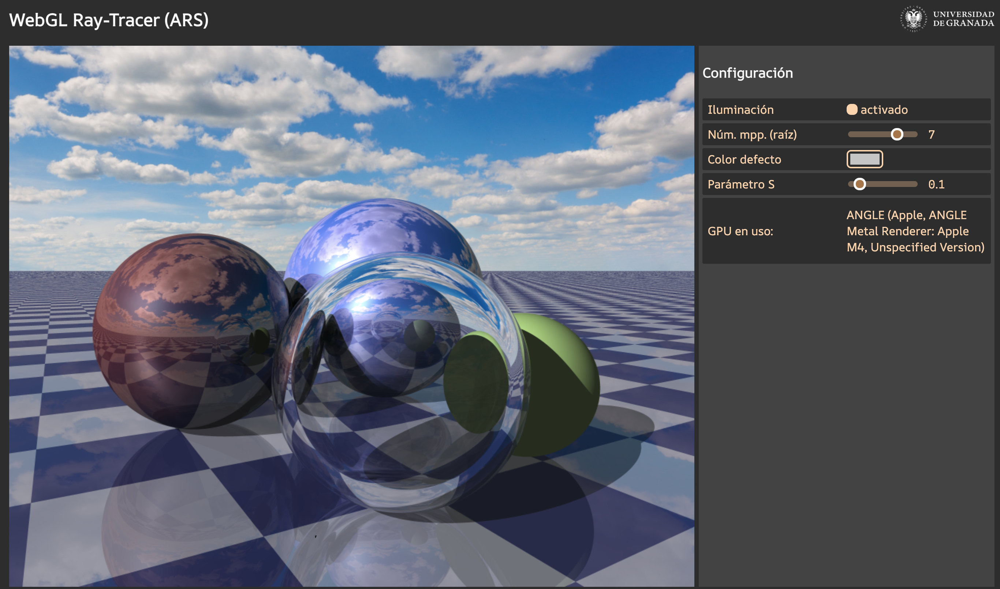
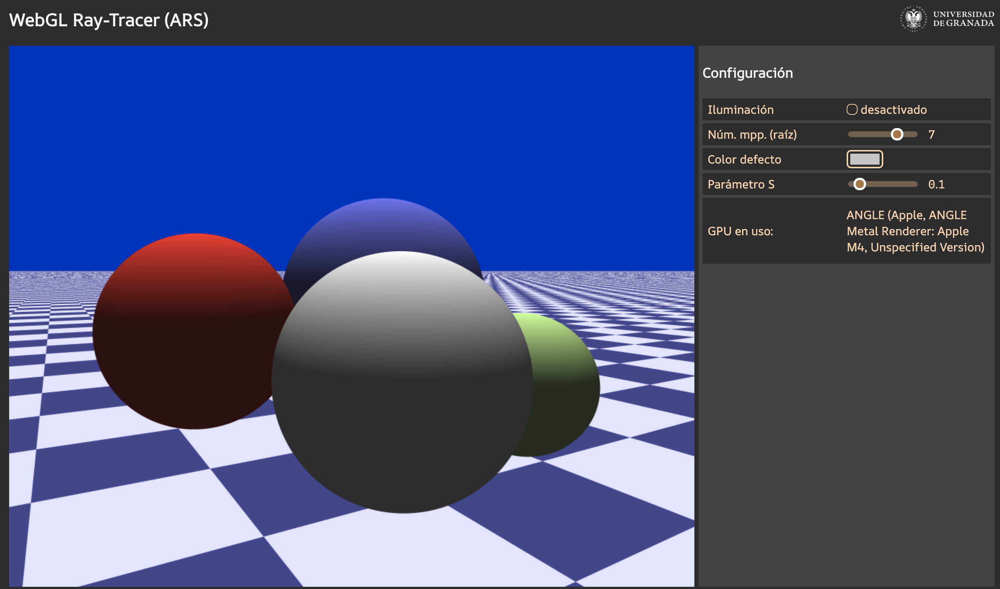

# ARS: Trazador de Rayos sencillo en un fragment shader


<p align="center">

</p>


Fuentes Typescript+GLSL de un trazador de rayos sencillo. También está los prerrequisitos e instrucciones de compilación y ejecución para la aplicación Web con el trazador de rayos sencillo.


## Uso de la aplicación.

Para ejecutar el servidor Web de la aplicación, es necesario antes leer los prerrequisitos y las instrucciones de instalación, compilación y ejecución (son similares a la [aplicación Web de la asignatura PCG](https://github.com/carlos-urena/progr-cauce-grafico/tree/main/fuentes/web)).

Una vez cargada la aplicación en el navegador, se puede observar la imagen creada por WebGL (a la izquierda) y un cuadro de controles (a la derecha), tal y como se ve aquí:

<p align="center">

</p>

Para modificar los parámetros de visualización, se puede:
  
  - Modificar la orientación de la cámara, arrastrando el ratón con el botón derecho pulsado.
  - Mover la cámara hacia adelante y hacia atrás, con la rueda del ratón.
  - Modificar alguno de los controles que aparecen en pantalla, a saber:
      - Botón para activar o desactivar la iluminación. Inicialmente está activado, se hace _ray-tracing_ completo con rayos secundarios. Cuando se desactiva, solo se procesan los rayos primarios (no hay sombras, reflejos ni transparencias), y no se evalua el MIL.
      - Deslizador con la raíz del número de muestras por pixel. Permite variar el valor dicha raiz (_n_) entre 1 y 9. El número total de muestras por pixel es <it>n</it><sup>2</sup> (así que podemos variar entre 1 y 91 muestras por pixel)
      - El valor del parámetro S (entre 0 y 1), para modificar diversos aspectos del Ray-tracer (por defecto no se modifica nada).

Aquí abajo se ve una captura de la aplicación con la iluminación desactivada (únicamente se procesan rayos primarios):

<p align="center">

</p>

Hay que tener en cuenta que cuando se usan un número de muestras por pixel superior a la unidad, el tiempo que se tarda en renderizar cada frame aumenta muchísimo.

## Prerrequisitos: 

+ Intérprete de *python3* para lanzar el servidor
+ Compilador de *typescript* para compilar fuentes


## Instalación del compilador de _Typescript_

### Linux

El compilador de _typescript_ se puede instalar con el gestor de paquetes de _Node Package Manager_ (NPM: [npmjs.com](https://www.npmjs.com/)). Para instalar NPM, se puede instalar antes la utilidad _Node Version Manager_ (NVM).

Se puede instalar NVM con `wget` según se dice en el repo: https://github.com/nvm-sh/nvm#installing-and-updating. Abrimos una nueva terminal y en ella hacer:

```
nvm install 18
```

Ahora está disponible la orden `npm` (_node package manager_), y la usamos para instalar el paquete que tiene el compilador de _typescript_ ([www.npmjs.com/package/typescript](https://www.npmjs.com/package/typescript)), así: 

```
npm install -g typescript
```


### macOS

Es necesario instalar _Node_, se puede hacer con el gestor de paquetes _Brew_ (), con la orden: 

```
brew install node
```

o bien descargarlo e instalarlo: https://nodejs.org/en/download. Una vez instalado, se dispone de la orden `npm`, la usamos para instalar el compilador de _typescript_, así:

```
npm install -g typescript
```

### Windows

En Windows usaremos siempre el terminal de tipo _Developer Powershell_. Hay que dar estos pasos:

Descargar e instalar _Node_ de aquí: 

[nodejs.org/en/download](https://nodejs.org/en/download)

Instalar el compilador 

```
npm install -g typescript 
``` 

Con esto, si no ha habido errores, estará disponible la orden `tsc`, se puede verificar poniendo:

`tsc --version`

## Ejecución de la aplicación en un navegador:

### Linux o macOS

Ejecutar el script `comp-lanzar.sh` que hay en la carpeta `scripts` (estando en ella), es decir:

``` 
cd scripts
./comp-lanzar.sh
``` 

Esto compila los fuentes Typescript (que necesiten recompilarse), y genera los fuentes Javascript. Si no ha habido errores al compilar, lanza un servidor Web local que hace accesible la aplicación Web en la URL que aparece en el terminal, es esta:

`http://0.0.0.0:8000`

### Windows

Ir a la carpeta `scripts` y ejecutar el script en el archivo `comp-lanzar.ps1` :

```
cd scripts 
./comp-lanzar.ps1 
```

La primera vez habrá que dar permisos al interprete de Python para que use la red (aunque sea localmente) para recibir peticiones y devolver la respuesta. 

Para probar la aplicación, usar la URL `http://localhost:8000` en cualquier navegador del equipo.